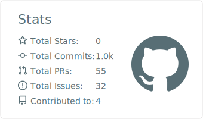
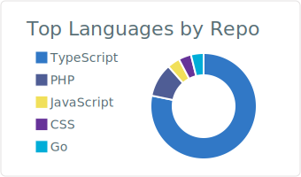

# こんにちは、massu-159 です 👋

東京を拠点に Web アプリケーション / Web サイトを開発しているエンジニアです。
TypeScript × Next.js を軸に、フロントエンドからバックエンド・インフラまで一気通貫で開発します。

- 🔭 現在の関心: Cloudflare Workers などのエッジ環境、AI (LLM) を組み込んだアプリ開発
- 💬 得意領域: Next.js / Hono / TypeScript でのフルスタック開発
- 📫 連絡先: [GitHub](https://github.com/massu-159) <!-- X, ブログ, ポートフォリオ等あれば追記 -->

## 🛠 Tech Stack

**Frontend**

**Backend**

**Infra / Tools**

## 📱 リリース済みアプリ

**[Daily's SPIDER Solitaire](https://apps.apple.com/jp/app/dailys-spider-solitaire/id6761255262)** — App Store で公開中の iOS ゲームアプリ（個人開発）

クラシックなスパイダーソリティアを、3段階の難易度と直感的な操作で遊べる iOS アプリとして企画・開発・リリースしました。

## 📊 Stats

  
  

